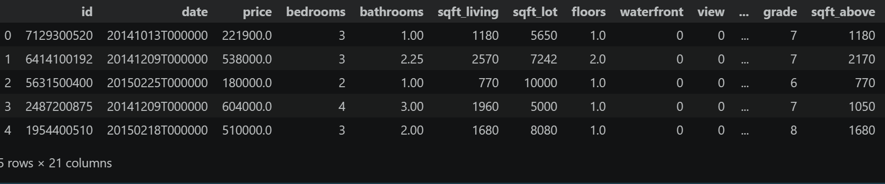
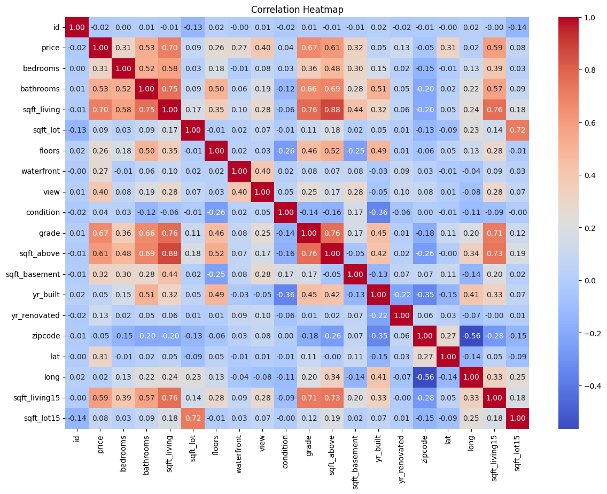
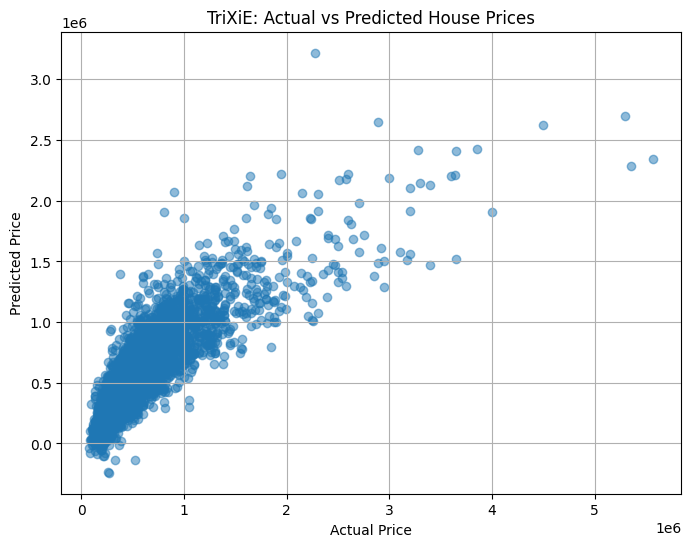
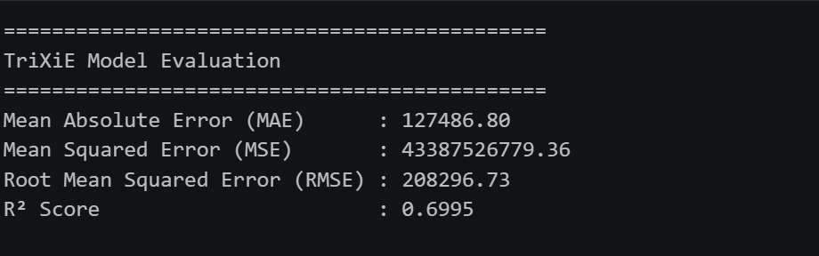

<p align="center">
  
</p>

<h1 align="center">🏠 House Price Prediction using Linear Regression</h1>

<p align="center">
  <b>A Machine Learning project that predicts house prices using the King County House Sales Dataset.</b>
</p>

<p align="center">
  
  
  
  
</p>

---

# 📌 Project Overview

This project implements a **Linear Regression** model to predict house prices using the **King County House Sales Dataset**.

The notebook demonstrates the complete Machine Learning workflow including:

- Data Collection
- Data Cleaning
- Exploratory Data Analysis (EDA)
- Feature Selection
- Model Training
- Model Evaluation
- Price Prediction

The objective is to understand how different house features influence market prices while building a predictive model using Python and Scikit-learn.

---

# 🚀 Features

- 📊 Data Loading & Inspection
- 🧹 Data Cleaning & Preprocessing
- 📈 Exploratory Data Analysis (EDA)
- 🔍 Feature Selection
- 🤖 Linear Regression Model
- 📉 Model Performance Evaluation
- 🏡 House Price Prediction
- 📋 Visualization of Results

---

# 📂 Dataset

**Dataset:** King County House Sales Dataset

| Details | Value |
|---------|-------|
| Records | **21,613** |
| Format | CSV |
| Target Variable | Price |
| File | `kc_house_data.csv` |

### Features Included

- Bedrooms
- Bathrooms
- Living Area
- Lot Area
- Floors
- Waterfront
- View
- Condition
- Grade
- Year Built
- Location
- Price (Target)

---

# 🛠️ Tech Stack

| Technology | Purpose |
|------------|---------|
| Python | Programming Language |
| Pandas | Data Manipulation |
| NumPy | Numerical Computing |
| Matplotlib | Data Visualization |
| Seaborn | Statistical Visualization |
| Scikit-learn | Machine Learning |
| Jupyter Notebook | Development Environment |

---

# 📁 Project Structure

```text
House_Price_Prediction_Linear_Regression/
│
├── banner.png
├── Akshat_Pandey.ipynb
├── kc_house_data.csv
├── README.md
└── images/
    ├── dataset.png
    ├── heatmap.png
    ├── regression.png
    └── prediction.png
```

---

# 🔄 Machine Learning Workflow

```text
Load Dataset
      │
      ▼
Data Cleaning
      │
      ▼
Exploratory Data Analysis
      │
      ▼
Feature Selection
      │
      ▼
Train-Test Split
      │
      ▼
Linear Regression Model
      │
      ▼
Model Evaluation
      │
      ▼
House Price Prediction
```

---

# 📊 Project Screenshots

## 📌 Dataset Preview

> *(Add screenshot here)*

```markdown

```

---

## 📈 Correlation Heatmap

> *(Add screenshot here)*

```markdown

```

---

## 📉 Regression Analysis

> *(Add screenshot here)*

```markdown

```

---

## 🏡 Prediction Result

> *(Add screenshot here)*

```markdown

```

---

# 📈 Machine Learning Algorithm

### Linear Regression

Linear Regression is a supervised Machine Learning algorithm that predicts continuous numerical values by finding the best-fit linear relationship between independent variables and the target variable.

The model is trained to estimate house prices based on multiple property characteristics.

---

# 🎯 Learning Outcomes

This project helped me understand:

- Data preprocessing
- Exploratory Data Analysis (EDA)
- Feature engineering
- Linear Regression
- Train-Test Split
- Model Evaluation
- Real-world Machine Learning workflow
- Data Visualization

---

# 💡 Future Improvements

- Implement Ridge & Lasso Regression
- Compare Multiple ML Models
- Hyperparameter Tuning
- Build a Flask Web Application
- Deploy on Streamlit
- Add Interactive Visualizations

---

# 👨‍💻 Author

## Akshat Pandey

🎓 B.Tech (Computer Science & Engineering)

💻 Machine Learning Enthusiast

🐙 GitHub: https://github.com/BuildWith_AXAT

---

<p align="center">

⭐ If you found this project useful, consider giving it a Star!

Made with ❤️ by <b>Akshat Pandey</b>

</p>
